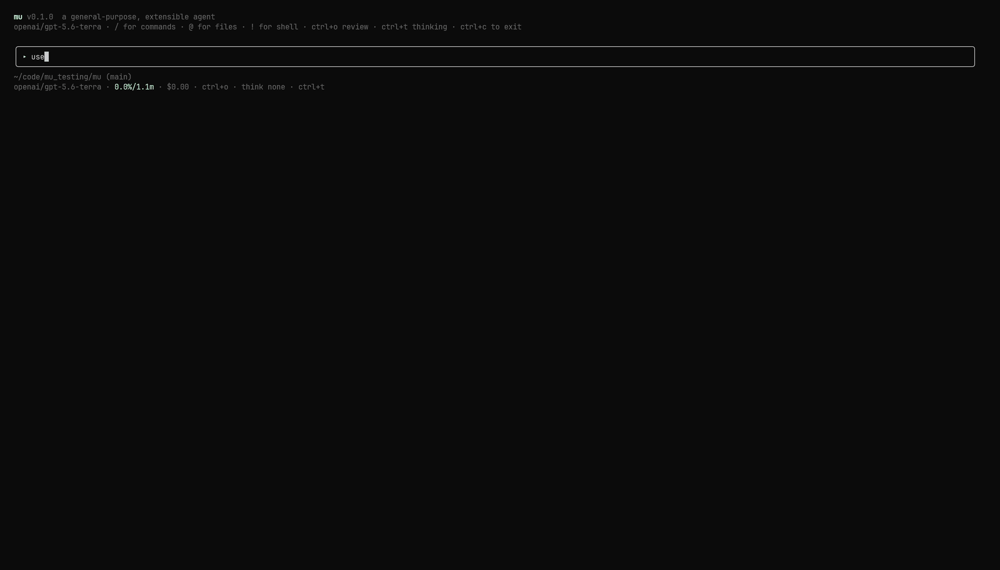

# Mu

Mu is an extensible AI agent for the terminal and TypeScript. Its default coding profile
provides repository inspection, file editing, shell commands, background processes,
permissions, checkpoints, and managed subagents. The underlying agent kernel is
domain-neutral: tools, prompts, permissions, commands, and TUI renderers are supplied by
profiles and extensions.



The same agent is available through three surfaces:

- `mu` — interactive terminal UI
- `mu -p` and `mu --rpc` — one-shot and NDJSON interfaces
- `@mu-agent/mu` — TypeScript SDK

## Install

The release installers and native archives include a pinned ripgrep binary. Native installs
do not require Bun.

```sh
# Linux x64 or macOS arm64
curl -fsSL https://raw.githubusercontent.com/Spandan7724/mu/main/scripts/install.sh | bash

# Windows x64 (PowerShell)
irm https://raw.githubusercontent.com/Spandan7724/mu/main/scripts/install.ps1 | iex
```

You can also install the CLI and SDK package with npm or Bun. This distribution runs on
Bun 1.3 or later.

```sh
npm install -g @mu-agent/mu
# or
bun install -g @mu-agent/mu
```

Native archives for Linux x64, macOS arm64, and Windows x64 are available on the
[releases page](https://github.com/Spandan7724/mu/releases). Bare single-file release
binaries do not include ripgrep; Mu uses `rg` from `PATH` when available.

Update or remove a recognized global installation with:

```sh
mu self update
mu self uninstall
mu self uninstall --purge  # also removes ~/.mu data
```

## Getting started

Start the interactive app, then run `/login` to configure an account or API key and
`/model` to choose among models available to those credentials.

```sh
mu
```

Common non-interactive forms:

```sh
mu -p "explain the failing tests"       # print one result
mu -p "review this change" --json       # stream JSON events
mu --resume <session-id>                # resume interactively
mu --resume <session-id> -p "continue" # resume headlessly
mu --rpc                                # NDJSON operations in, events out
```

Useful options include:

```text
--model <provider/model>       select a model
--profile <name>               load a profile (default: coding)
--max-turns <n>                set a turn budget
--max-cost <usd>               set a cost budget
--permission-mode <mode>       default | accept-edits | plan-readonly | yolo
--no-instructions              disable instruction loading for this run
```

Run `mu --help` for the complete CLI reference.

## Authentication and models

`/login` stores provider-scoped credentials in `~/.mu/auth.json`. Account sign-in is
available for OpenAI Codex/ChatGPT, GitHub Copilot, Kimi Code, OpenRouter, and xAI. Direct
API-key routes include Anthropic, OpenAI, Google, Z.AI Coding Plan, Qwen Token Plan, and
other providers supported by the built-in transport catalog. Anthropic subscription OAuth
is not supported.

Environment variables such as `ANTHROPIC_API_KEY`, `OPENAI_API_KEY`, and `GEMINI_API_KEY`
can be used instead for unattended runs. `/logout` removes only credentials saved by Mu;
it does not change environment variables.

OpenAI API-key (`openai/*`) and ChatGPT-plan (`openai-codex/*`) models use separate
credentials and can coexist. Both routes receive OpenAI's hosted web-search tool
automatically. Other providers currently run without web search.

### Local llama.cpp models

Mu discovers the model loaded by `llama-server` at `http://127.0.0.1:8000` and exposes it
as `llama-cpp/<alias>`:

```sh
./build/bin/llama-server \
  -hf ornith-ai/Ornith-1.5-9B-GGUF:Q4_K_M \
  --alias ornith-1.5-9b \
  --host 127.0.0.1 \
  --port 8000 \
  --jinja

mu --model llama-cpp/ornith-1.5-9b
```

Set `LLAMA_CPP_BASE_URL` for another address and `LLAMA_CPP_API_KEY` for a protected
server. Tool use depends on the loaded model and chat template; `--jinja` is normally
required.

## Coding profile

The default profile provides:

- file reads, directory listing, exact multi-edit writes, and new-file creation;
- foreground and PTY-backed background shell commands;
- repository search with `rg` and `rg --files` through the shell tool;
- per-call permission checks with proposed diffs for file changes;
- one shadow-git checkpoint per user turn, without committing to or changing the user's
  Git repository;
- `/undo`, `/redo`, `/fork`, and `/diff` over the session and its workspace changes;
- durable JSONL session trees, transcript export, and context compaction;
- managed `task` delegation plus coding-specific `search` and `counsel` subagents.

Read-only operations are allowed by default. File changes and commands are checked by the
coding profile's permission rules. `/permissions` changes the mode for the current process;
an “always allow” response stores an exact project rule. `--permission-mode yolo` and
`--allow-all` remove Mu's permission prompts but do not provide an OS sandbox.

Checkpoints are stored separately under `~/.mu/checkpoints`. They include tracked,
untracked, and ignored workspace files while excluding repository metadata and Mu's own
`.mu` state.

### Sessions and compaction

CLI sessions are stored by profile scope under `~/.mu/sessions`. They are append-only JSONL
trees, so forks, undo, and compaction add entries rather than rewriting history.

- `/resume` opens a saved conversation; `/rename` gives it a stable label.
- `/new` starts a clean conversation without deleting the previous one.
- `/export [path.md]` writes the complete active branch, including turns older than a
  compaction boundary.
- `/compact [focus]` compacts immediately. Mu also compacts automatically near 85% of the
  active model's context window and retries once after a context-overflow error.
- `/btw [question]` opens an ephemeral read-only side conversation using the current
  context as reference. It is not saved or merged back into the main session.

### Interactive controls

The TUI keeps a typed transcript in the terminal's primary buffer and renders Markdown,
diffs, tool activity, approvals, and live background output. Notable controls are:

| Input | Action |
|---|---|
| `Ctrl+O` | Review the transcript and expand tool activity |
| `Ctrl+T` | Cycle the active model's reasoning level |
| `Shift+Tab` | Cycle permission modes |
| `Enter` during a run | Steer before the next model request |
| `Tab` during a run | Queue a follow-up turn |
| `Alt+Up` | Withdraw the newest queued input for editing |
| `Ctrl+J` | Insert a newline |
| `!command` | Run a user-authored shell command without a model call |
| `Ctrl+B` | Switch between main and `/btw` conversations |

Run `/keybindings` in the TUI for the current list.

## Instructions, extensions, skills, and MCP

The coding profile reads project instructions from `AGENTS.md` and compatible fallback
files, stopping at the nearest configured project root. It supports
`AGENTS.override.md`, `.mu/rules/`, `.claude/rules/`, conditional `paths` frontmatter, and
scoped `@file` imports. Global instructions live under `~/.mu`; project configuration lives
under `.mu/`.

Use `/instructions` to inspect loaded sources, `/instructions reload` or `/reload` to
rescan them, and `--no-instructions` to disable loading for one invocation.

Mu also loads:

- TypeScript extensions from `~/.mu/extensions` and `.mu/extensions`;
- Markdown commands from `~/.mu/commands` and `.mu/commands`;
- skills from the built-in user and project skill roots;
- stdio MCP servers from user and project `.mu/config.json` files.

An MCP configuration looks like this:

```json
{
  "mcpServers": {
    "docs": {
      "command": "bunx",
      "args": ["-y", "your-mcp-server"],
      "env": { "SERVER_TOKEN": "..." }
    }
  }
}
```

Project entries override user entries with the same name. MCP tools are registered as
`mcp_<server>_<tool>` and pass through the normal permission and event paths.

## Managing several sessions

`mu agents` manages several ordinary Mu sessions for the current workspace. A local
supervisor owns one worker process per live session, so workers can continue after the
viewer closes. Attaching to a row opens the standard conversation UI; stopping or removing
a row does not delete its normal JSONL session.

```sh
mu agents
mu agents stop
```

Workers in the same workspace share its filesystem. Mu serializes its own checkpoint Git
operations, but simultaneous agents can still observe and overwrite each other's file
changes. Assign disjoint work or coordinate them explicitly.

## TypeScript SDK

Install `@mu-agent/mu` locally. The package requires Bun at runtime.

```sh
bun add @mu-agent/mu
```

`new Agent()` is the low-level, domain-neutral API. It has a general prompt, no tools, an
in-memory session store, and no extensions unless you provide them.

```ts
import { Agent } from "@mu-agent/mu";

const agent = new Agent({
  model: "anthropic/claude-sonnet-5",
  budget: { maxTurns: 8, maxCostUsd: 1 },
});

const result = await agent.run("Explain the trade-offs of this API design");
console.log(result.text);
```

`createAgent()` installs managed `task` delegation. Selecting the coding profile adds the
same tools, permissions, project context, checkpoints, runtime, and coding specialists as
the CLI.

```ts
import { createAgent } from "@mu-agent/mu";

const agent = await createAgent({
  profile: "coding",
  profileOptions: { root: process.cwd() },
});

const result = await agent.run("Find and fix the failing test");
console.log(result.text);
await agent.shutdown();
```

The SDK also exposes Zod-backed custom tools, structured output, event streaming,
permission callbacks, custom providers and models, pluggable session stores, extensions,
and transcript serialization. See the
[`@mu-agent/mu` package README](packages/cli/README.md) for a compact SDK example.

## Architecture

Mu is a Bun workspace with a one-way dependency structure:

```text
CLI → TUI → SDK → core → AI providers
                ↑
             profiles
```

- `packages/ai` owns thin provider clients, streaming conversion, model metadata, and
  pricing.
- `packages/core` owns the domain-neutral loop, messages, events, permissions, sessions,
  compaction, registries, and extension host.
- `packages/sdk` exposes `Agent` and the reusable SDK services.
- `packages/profiles/coding` owns all repository, filesystem, shell, and checkpoint logic.
- `packages/tui` consumes the same serializable event stream used by RPC and SDK streaming.
- `packages/cli` assembles the published binary and SDK package.

The core and AI packages deliberately contain no current-directory, file-path, Git, or
other coding-domain assumptions.

## Development

Development uses Bun 1.3.14, strict TypeScript, Biome, and `bun test`.

```sh
bun install
bun run ci          # typecheck, lint, tests, kernel-purity check
bun run build       # dist/mu
bun run build:npm   # package CLI and SDK outputs
bun run verify:npm  # build and exercise an external SDK consumer
bun run pack:npm    # create the npm tarball in dist/
```

Cross-platform binary targets:

```sh
bun run build:linux
bun run build:macos
bun run build:windows
```

Mu is licensed under the [MIT License](LICENSE).
