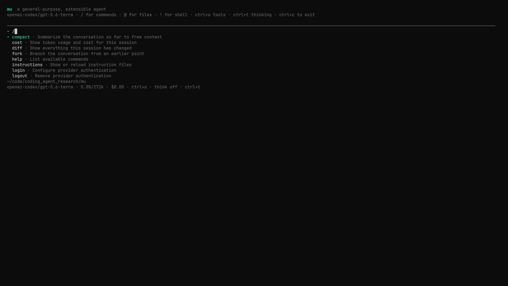

# mu

A general-purpose, extensible AI agent platform. Out of the box mu is a polished coding
agent; swap its **profile** (tools + prompts + permissions + UI renderers) and the same
kernel becomes a computer-use agent, an automation agent, or any other tool-using agent.



Three surfaces, one kernel, one event stream:

- **TUI** — interactive terminal app (`mu`)
- **RPC / headless** — `mu --rpc` (NDJSON events/ops), `mu -p "..."` one-shot
- **SDK** — `import { Agent } from "@mu-agent/mu"` for building automations in TypeScript

## Install

```sh
# Linux / macOS, — installs to ~/.mu/bin
curl -fsSL https://raw.githubusercontent.com/Spandan7724/mu/main/scripts/install.sh | bash

# Windows, — installs to %USERPROFILE%\.mu\bin
irm https://raw.githubusercontent.com/Spandan7724/mu/main/scripts/install.ps1 | iex

# With npm (requires Bun)
npm install -g @mu-agent/mu

# Or with Bun
bun install -g @mu-agent/mu

# Update an existing install — npm, Bun, or either script above
mu self update

# Or download the packaged native release — no runtime needed.
# Linux:
tar -xzf mu-linux-x64.tar.gz
./mu-linux-x64/bin/mu --help

# macOS (Apple Silicon):
tar -xzf mu-darwin-arm64.tar.gz
./mu-darwin-arm64/bin/mu --help

# Windows PowerShell
Expand-Archive .\mu-windows-x64.zip
.\mu-windows-x64\bin\mu.exe --help
```

Every install route above includes a pinned, checksum-verified ripgrep sidecar for fast
search: the scripts and the packaged native releases unpack it next to the binary, and
npm uses an OS/CPU-specific optional package with no postinstall download. Only the bare
single-file binaries from the releases page lack it, falling back to `rg` from `PATH` or
mu's built-in search.

Install the same package locally to use the TypeScript SDK:

```sh
npm install @mu-agent/mu
# or: bun add @mu-agent/mu
```

```ts
import { Agent, createAgent } from "@mu-agent/mu";

// A domain-neutral agent with a general prompt and no tools.
const assistant = new Agent();
console.log((await assistant.run("Explain how an AI agent loop works")).text);

// Mu's built-in coding profile: file, search, shell, task, and checkpoint tools.
const codingAgent = await createAgent({
  profile: "coding",
  profileOptions: { root: process.cwd() },
});
console.log((await codingAgent.run("Summarize this directory")).text);
await codingAgent.shutdown();
```

Start mu and run `/login` to choose account sign-in or a stored API key. Account sign-in
supports OpenAI Codex/ChatGPT, GitHub Copilot, Kimi Code, OpenRouter, and xAI. Anthropic
is API-key-only. Z.AI Coding Plan and Qwen Token Plan are also available through their
API-key endpoints. Environment variables remain available for unattended use:

```sh
export ANTHROPIC_API_KEY=...   # or OPENAI_API_KEY / GEMINI_API_KEY / provider-specific key
mu                             # interactive; /login configures authentication
mu --resume <session-id>       # continue a saved interactive session
mu -p "fix the failing test"   # one-shot
mu --rpc                       # NDJSON events out, ops in
```

Run `mu agents` to manage several sessions whose worker processes survive closing the
viewer. Managed sessions commit the initiating prompt before contacting the provider and
commit every completed assistant/tool turn before starting the next one. If a supervisor,
worker, or machine stops during an in-flight provider or tool call, Mu marks that runtime
failed and resumes from the last committed boundary; it never automatically replays the
interrupted operation or claims exact mid-turn continuation.

Coding workers that share a workspace serialize shadow-checkpoint Git operations with a
cross-process ownership lock, including stale-owner recovery. Their filesystem itself is
still shared: simultaneous agents can observe one another's edits, so coordinate tasks
that modify the same files.

Managed workers support built-in and external profiles through `--profile`. Profile
commands, scoped session storage, runtime lifecycle hooks, and TUI renderers are preserved
in managed mode. Environment needed only by a custom profile can be forwarded with
uppercase `MU_PROFILE_*` variables; process identity variables such as `HOME` are never
accepted through the viewer-to-supervisor handoff.

## Context compaction

Mu automatically compacts context near 85% of the active model window and recovers once
from provider context-overflow errors. Run `/compact` to compact immediately, or add a
focus such as `/compact preserve the migration decisions`. If a turn is active, the
operation queues behind it. The TUI shows compaction progress and a durable before/after
boundary; a failed or cancelled compaction preserves the original conversation.

The compactor clears old reproducible tool output first, summarizes a bounded labelled
history, and retains a token-budgeted recent tail with tool calls and results kept
together. Compaction metadata is stored in the JSONL session tree, so resuming reconstructs
the same summary and verbatim tail. Switching to a smaller-window model uses the previous
model to summarize while sizing the retained tail for the destination window.

## Transcript export

Run `/export` in the interactive app to save the complete current chat branch as a
timestamped Markdown file in the current directory, or use `/export path/to/chat.md`.
Export includes turns older than compaction boundaries and follows the active fork/undo
branch, while hidden instruction snapshots stay private. Existing files are never
overwritten. SDK consumers can produce the same representation with `sessionToMarkdown()`.

## MCP servers

Add stdio servers to `~/.mu/config.json` or a project's `.mu/config.json`:

```json
{
  "mcpServers": {
    "docs": {
      "command": "bunx",
      "args": ["-y", "your-mcp-server"],
      "env": { "SERVER_TOKEN": "..." }
    }
  }
}
```

mu discovers tools and resources at startup. Remote tools are named
`mcp_<server>_<tool>` and use the normal permission rules, so an `mcp_*` rule can ask,
allow, or deny them. Project server entries override user entries with the same name.

## Development

Requires [Bun](https://bun.sh).

```sh
bun install
bun run ci        # typecheck + lint + tests + kernel-purity check
bun run build     # single-file binary at dist/mu
bun run pack:npm  # publishable @mu-agent/mu tarball in dist/
```

Building for other platforms:

```sh
bun run build:linux    # dist/mu-linux-x64
bun run build:macos    # dist/mu-darwin-arm64
bun run build:windows  # dist/mu-windows-x64.exe

# After building the matching native binary:
bun run package:linux    # dist/mu-linux-x64.tar.gz
bun run package:macos    # dist/mu-darwin-arm64.tar.gz
bun run package:windows  # dist/mu-windows-x64.zip
```
